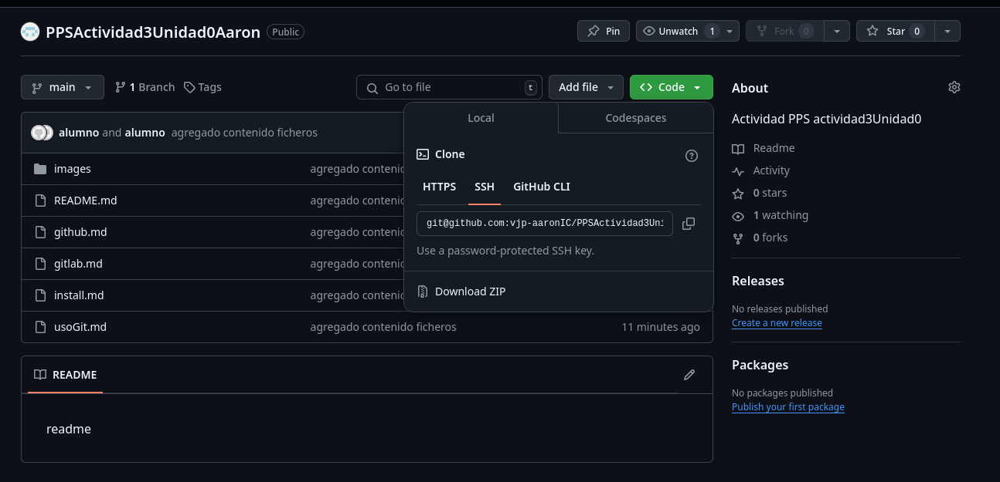

# MANUAL BÁSICO DE GITHUB
## Uso de Github
El principal uso de **Github** es ofrecer a los usuarios una plataforma donde pueden colaborar en la nueve trabajando de forma local.
Desde Github podemos ver todo el contenido versionado y documentado en diferentes ramas para hacer más sencilla la modificación **simultánea** de código.

##  Clonado del repositorio

Una vez configurado el git en nuestra máquina podemos clonar proyectos con el siguiente comando *_git clone url_*, donde url es la ruta de git donde está el proyecto que queremos clonar.

Podemos clonar también mediante **SSH** copiando el enlace del apartado de SHH dentro de *_clone_*

