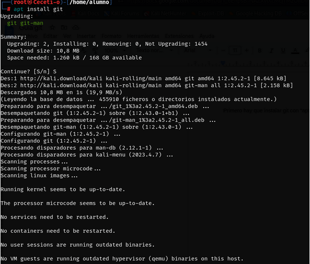
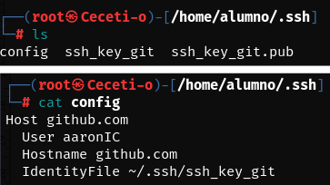

# INSTALAR Y CONFIGURAR GIT

1. Instalar Git
El primer paso es instalar git en nuestra máquina mediante el comando *_sudo apt install git_* de la siguiente manera.

2. Conectar el usuario de github
Para conectar el usuario con git es necesario crear una clave rsa desde la terminal y agregarla al directorio ~/.ssh y agregar la clave al fichero config que hay en esta carpeta en caso de que no exista hay que crearlo y agregarlo.
 

Una vez configurado el fichero config. La tenemos que agregar al github desde Settings > SSH keys.
En el recuado de texto tenemos que introducir el contenido de la clave ssh creada anteriormente con la extensión .pub.

