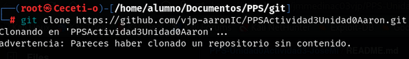
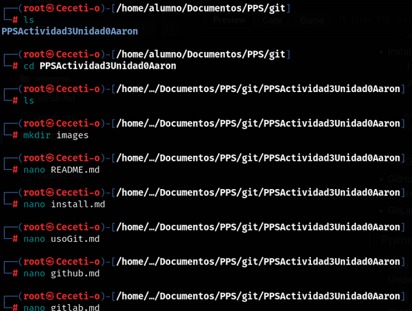
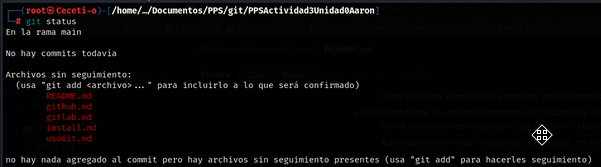
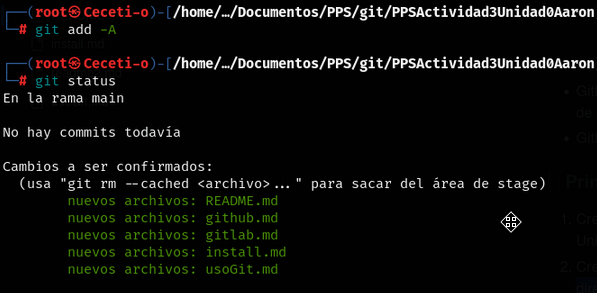
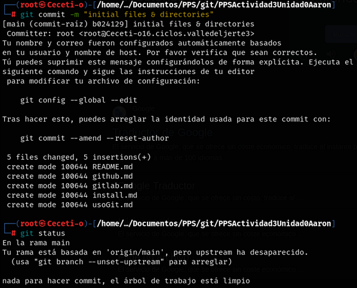

# MANUAL BÁSICO DE GITHUB

1. Clonado del repositorio

Una vez configurado el git en nuestra máquina podemos clonar proyectos con el siguiente comando *_git clone url_*, donde url es la ruta de git donde está el proyecto que queremos clonar.

2. Creación y subida de cambios a la rama

Dentro de la carpeta que se nos crea al clonar el proyecto podemos crear todos los directorios y ficheros que queramos y una vez creados podemos subirlos.

Para comprobar el estado de la rama usamos el comando *_git status_* y el contenido que salga en rojo son ficheros que estan en nuestro local pero no están en la rama, ni están preparados apra subirse.

Para agregar los ficheros que queremos subir usamos el comando *_git add_* o si quieres agregarlos todos a la vez puedes usar *_git add -A_*.

Para subir los cambios que hemos agregado en el paso anterior, usamos el comando *_git commit -m "msg"_*, donde msg es un comentarion para identificar el commit que vamos a subir a la rama.

Por último, para subir a la rama los cambios usaremos el comando *_git push origin main_*.
